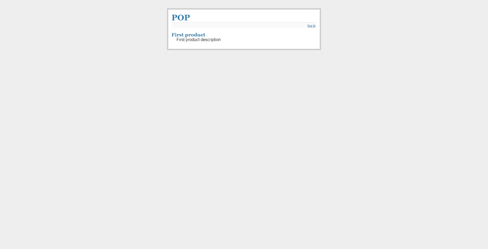
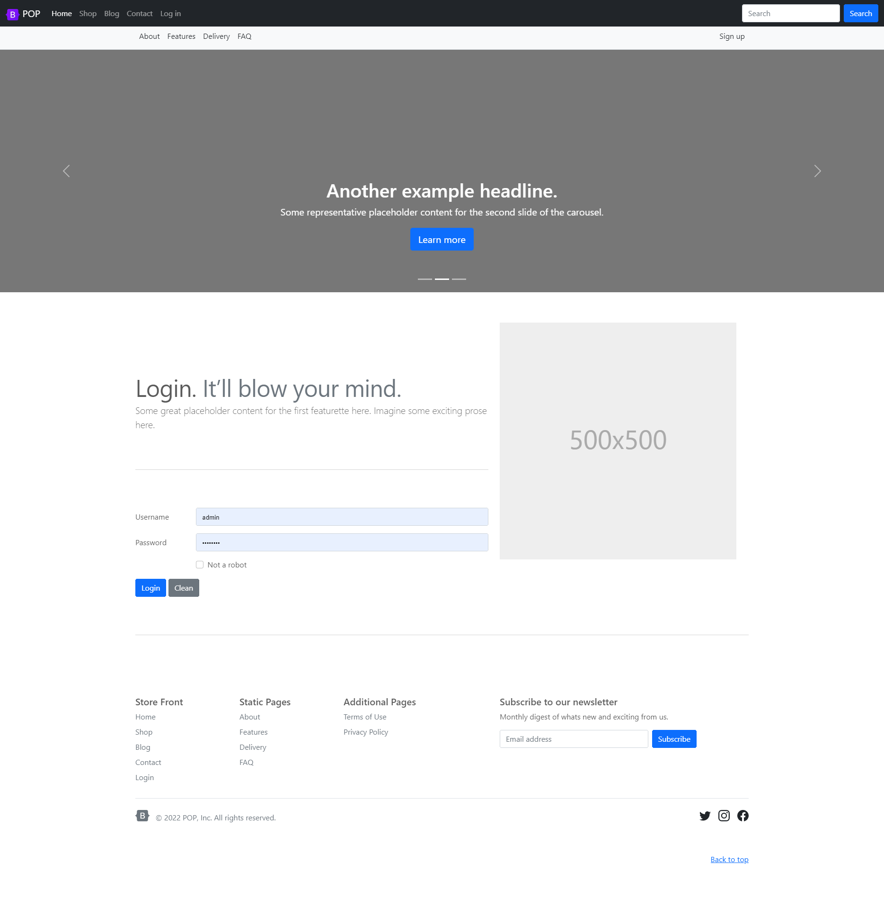

# POP (Perl shOP)

Made with:

* Love
* Perl5
* Dancer2
* SQLite3
* Bootstrap5

in The Kingdom of Spain.

## Home

## Store Front

## Back Office

## Dependencies:

* Dancer2
* Template Toolkit
* File::Slurper
* DBD::SQLite
* Dancer2::Plugin::Database

Installing for Debian/Ubuntu/WSL:

*apt install libdancer2-perl*

*apt install libtemplate-perl*

*apt install libfile-slurper-perl*

*apt install libdbd-sqlite3-perl*

*apt install libdancer2-plugin-database-perl*

## Application launching:

Starting your mail server, for example:

*sudo service postfix start*

Starting the app:

*plackup -p 5000 bin/app.psgi*

For development:

*plackup -p 5000 -R lib bin/app.psgi*

Enjoy!

http://localhost:5000

**admin/password**

## Screenshots

